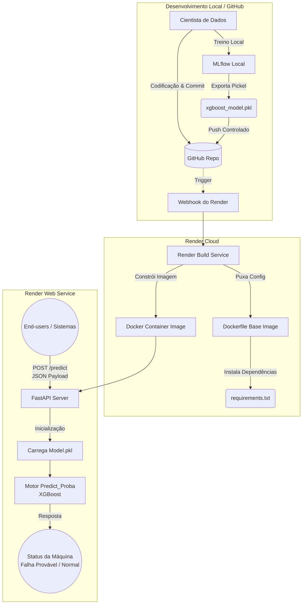

# Deployment Architecture

O fluxo abaixo apresenta a arquitetura MLOps para implantação de modelos na plataforma Render, utilizando integração contínua (GitHub), conteinerização (Docker) e exposição do modelo encapsulado numa API REST (FastAPI).

## Architecture Diagram

## Description
A arquitetura foi propositalmente desenhada de forma "Enxuta e Escalável" (Lean & Scalable).
1. **Ambiente de Desenvolvimento:** O uso de *MLflow* restringe-se ao controle e versionamento local de parâmetros, resguardando o ambiente de deploy de componentes pesados que são apenas úteis no desenvolvimento (não sobem para o Github). Optuna refina a performance e o XGBoost resultante é exportado fisicamente em formato `.pkl`.
2. **Entrega Contínua (Render Web Services):** O aplicativo hospeda-se em um serviço PaaS ativado por webhook via GitHub. Quando atualizações no modelo `.pkl` ou regras do `app.py` são realizadas na ramificação primária, a plataforma providenciará a reconstrução (Build) utilizando o plano explícito no `Dockerfile` com o runtime enxuto do Python.
3. **Serviço REST API:** O modelo treinado fica carregado em memória primária pelo `FastAPI`. Requisições chegam validadas estruturalmente pelo *Pydantic* e as previsões (ex: "Will fail in next 5 cycles") de risco são consumidas simultaneamente com baixa latência para os pipelines interativos do lado da engenharia de manutenção.
