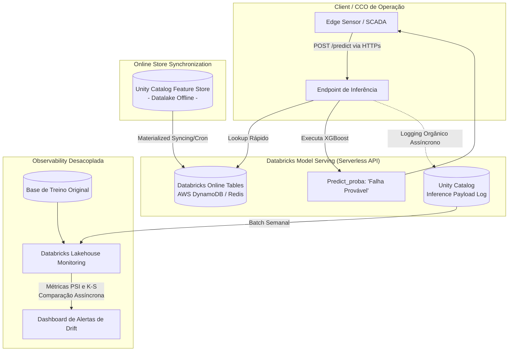

# Enterprise Databricks Architecture: Predição de Falhas O&G

Esta documentação detalha a proposta arquitetônica "Padrão Ouro" para implantação da Máquina Preditiva sob o ecossistema corporativo da **Databricks** utilizando a arquitetura de **Medallion Lakehouse**. A governança centralizada ocorre através do `Unity Catalog`.

Nesse modelo rigoroso, a flexibilidade foi desmembrada em dois paradigmas operacionais:
1. **Cenário Batch D-1:** Processamento noturno econômico focado em dados já gravados.
2. **Cenário Real-Time / Streaming:** Avaliação preditiva consumida online por APIs nos painéis de controle, tracionando micro-segundos em dados pulsantes.

---

## 1. Arquitetura Batch (D-1)
Este modelo processa as predições dos rolamentos de todas as máquinas num ciclo massivo (geralmente durante a noite) analisando os dados do dia que passou e estipulando quebras para amanhã.

### 📝 Diagrama D-1 (Batch Workflow)

```mermaid
flowchart TD
    subgraph Ingestão e Engenharia ["Data Engineering (DLT)"]
        Raw[(JSON/Logs Legados O&G)] --> |Auto Loader| Bronze[Bronze Table (Unity Catalog)]
        Bronze -->|Databricks DLT| Silver[Silver Table (Limpeza/Nulos FFill)]
        Silver -->|Feature Engineering| GoldFeature[(Feature Store Table no UC)]
    end

    subgraph MLOps e Inferência ["MLOps / Databricks Workflows"]
        ModelRegistry((MLflow Model Registry))
        GoldFeature -->|Job Noturno Agendado| BatchInference[Databricks Workflow: Batch Infer\nCarrega xgboost_model.pkl]
        ModelRegistry -.->|Injeta versão PROD| BatchInference
        BatchInference -->|Aplica .predict_proba| GoldSBR[(Gold Table Predições da Frota)]
    end

    subgraph Observabilidade e Drift ["Databricks Lakehouse Monitoring"]
        GoldFeature -.-> DeltaMonitor[Monitor Assessment Profiling]
        GoldSBR -.-> DeltaMonitor
        DeltaMonitor -->|Cálculo Assíncrono Semanal\n K-S, PSI| DriftResults[(System Tables / Metrics)]
        DriftResults -.->|Alarme Slack/Dev| Engineer((Sênior DS))
    end
```

**Análise Sênior (Batch D-1):**
Nesse cenário as features são gigantescas (Datalakes). Criamos instâncias efêmeras usando Job Clusters da AWS/Azure, computando o parque fabril inteiro simultaneamente, e gravamos na Gold Table para um PowerBI puxar no dia seguinte. Aqui o Data Drift Monitor atua diretamente olhando as mudanças de Distribuição da Feature Store Table contra os Parâmetros Originais.

---

## 2. Arquitetura Real-Time (Alta Disponibilidade / API)
Quando o engenheiro visualiza um manômetro no CCO operacional em tempo real, nossa previsão deve reagir ao input na ordem de Milisegundos.

### 📝 Diagrama API (Databricks Model Serving Serverless)



---

## 3. Justificativa Estratégica: Por que Drift não corre "vivo" na API? (Decisão MLOps Sênior)

Numa conversa superficial, poderia ser sugerido imbuir cálculos analíticos como o *Population Stability Index (PSI)* e o teste **Kolmogorov-Smirnov (K-S)** diretamente no script interno de reposta do **Databricks Model Serving**.
Como Engenharia Sênior, eu **vetei formalmente** essa abordagem e o diagrama reflete isso pelas seguintes restrições:

1. **A Maldição de Latência em Tempo Real:** Operacionalmente, nossa API deve devolver previsões num Threshold inferior a 25 milissegundos. Calcular histogramas e caudas normais para cruzar as distribuições P-Value no voo engarrafaria a requisição até matá-la em status de `Timeout`.
2. **O Paradoxo Populacional do Online Inference:** Modelos não podem sofrer Drift baseado num único *JSON* (Request Point) recém entrado. O K-S avalia conjuntos extensos de populações. Realizar *caching* ou filas em memória física restrita no contêiner do *Endpoint Serving* quebra o paradigma de API Stateless.
3. **Mecanismo Feature Store Online:** As métricas antigas dos sensores precisam estar na casa de poucos milisegundos de busca. Se o Databricks batesse as *Rolling Features* diretamente na Gold Table de Delta (Datalake), haveria lag. A solução é plugar o *Databricks Online Tables* — que atua sincronizando os atributos para um banco em memória ou chave-valor (ex: *Redis, DynamoDB, Cosmos DB*) e garante latências submilisegundos nativamente via MLOps.

### Conclusão Dinâmica (Inference Payload Logging)
Por estas razões, a arquitetura MLOps Real-time adota o desacoplamento do Drift. Quando a *FastAPI* atirada via **Databricks Model Serving** solta a previsão do motor estocástico (LightGBM/XGBoost), o Databricks realiza o **Payload Logging**.
Isso significa que, nas sombras (assincronamente), o JSON é capturado e gravado magicamente em uma Tabela Delta no *Unity Catalog* conhecida como **Inference Table**. E somente com tranquilidade, de semana em semana, o Job nativo *Databricks Lakehouse Monitoring* fará as continhas sensíveis de PSI e Kolmogorov-Smirnov nessas montanhas de Log para dar ao C-Level os alertas orgânicos de degradação.
