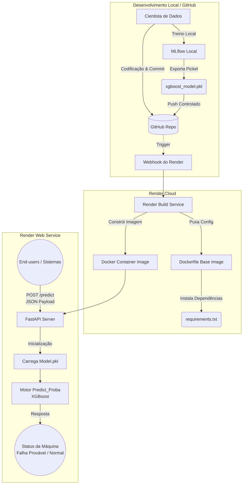
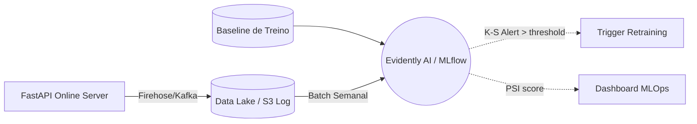

# Deployment Architecture

O fluxo abaixo apresenta a arquitetura MLOps para implantação de modelos na plataforma Render, utilizando integração contínua (GitHub), conteinerização (Docker) e exposição do modelo encapsulado numa API REST (FastAPI).

## Architecture Diagram

## Description
A arquitetura foi propositalmente desenhada de forma "Enxuta e Escalável" (Lean & Scalable).
1. **Ambiente de Desenvolvimento:** O uso de *MLflow* restringe-se ao controle e versionamento local de parâmetros, resguardando o ambiente de deploy de componentes pesados que são apenas úteis no desenvolvimento (não sobem para o Github). Optuna refina a performance e o XGBoost resultante é exportado fisicamente em formato `.pkl`.
2. **Entrega Contínua (Render Web Services):** O aplicativo hospeda-se em um serviço PaaS ativado por webhook via GitHub. Quando atualizações no modelo `.pkl` ou regras do `app.py` são realizadas na ramificação primária, a plataforma providenciará a reconstrução (Build) utilizando o plano explícito no `Dockerfile` com o runtime enxuto do Python.
3. **Serviço REST API:** O modelo treinado fica carregado em memória primária pelo `FastAPI`. Requisições chegam validadas estruturalmente pelo *Pydantic* e as previsões (ex: "Will fail in next 5 cycles") de risco são consumidas simultaneamente com baixa latência para os pipelines interativos do lado da engenharia de manutenção.

## Feature / Data Drift e Continuous Monitoring (Métricas K-S e PSI)

Em resposta direta a diretrizes de **Observabilidade**, a arquitetura de MLOps abrange nativamente o rastreamento orgânico da decadência preditiva, contudo com separação lógica clara em relação à inferência online (API).

**Decisão de Engenharia Sênior sobre Implementação em Produção:**
*Não procedemos com o cálculo de Data Drift (PSI / K-S) diretamente no script vivo do `app.py`* gerando retornos síncronos na Render:
1. Trabalhamos sob o modelo de Inferência Online Síncrona, onde os payloads da rede da indústria batem **uma linha por vez**. Testes estatísticos de desvio como o Teste de **Kolmogorov-Smirnov (K-S)** dependem formalmente de comparação bicaudal entre vetores densos (população base de treino versus população diária contínua). Fazer isso um a um seria fisicamente impossível e alocá-los em cache quebra o princípio Stateless do serviço.
2. A **Métrica PSI (Population Stability Index)** exige o agrupamento em vigis (Decis de Probabilidade). Engarrafar o Servidor Web com cálculos de agrupamento mataria a latência e incorreria em Out-of-Memory Errors.

### A Correta Orquestração do Drift Espelhado
Em vez do acoplamento cego no endpoint de resposta, a arquitetura estipula que a API age como um vertedouro:

1. Toda inferência JSON batida na API é espelhada via log leve para um banco de dados relacional ou Object Storage (ex: Datalake, ElastickStack).
2. Mecanismos como **Evidently AI** ou Crons no **Databricks Workflows** rasparão as médias sensoriais desses logs diariamente de braço dado aos dados de baselining oficiais.
3. Se o desnível do *Kolmogorov-Smirnov* na assinatura vibracional dos rolamentos bater um alpha menor que p=0.05, os alertas estouram confirmando que a calibração quebrou o Tracking, exigindo reconceituação de hiperparâmetros.
